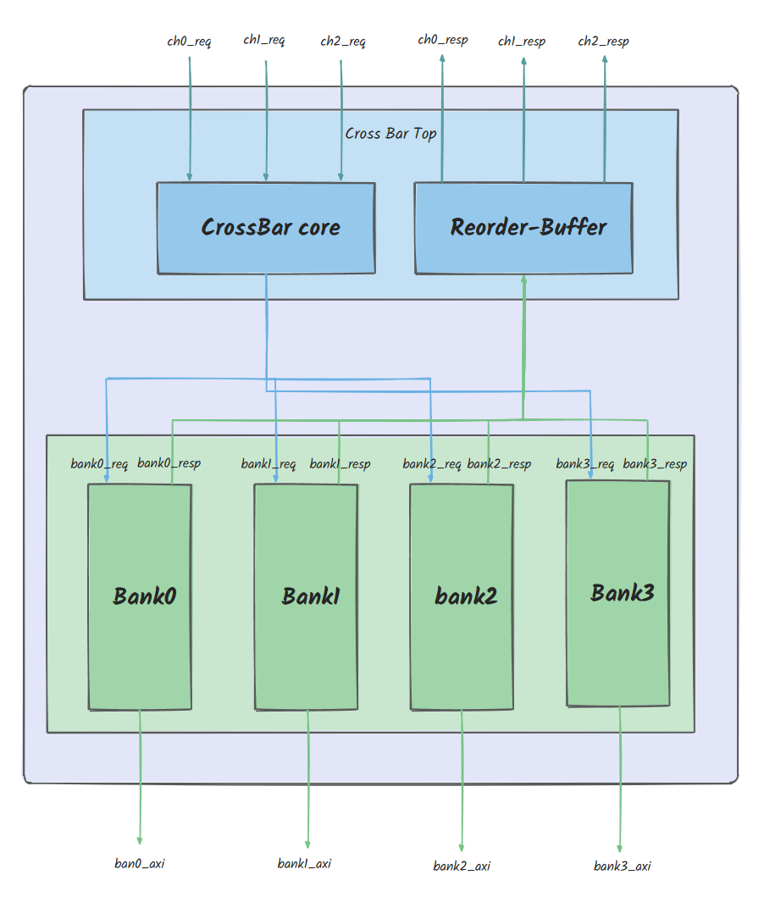

# mcash
## 1. Introduction

​	Mcash is a multi-port cache that supports parallel access from 3 channels and processes memory access requests through 4 banks.




## 2. How to run mcash

build golden.so 
```shell
cd golden
make clean
make
```
build simv

```shell
cd simulation/sim
make vcs
```
run your case
```shell
cd simulation/sim
make sim CASE_PATH=xxx CASE_NAME=xxx
```
